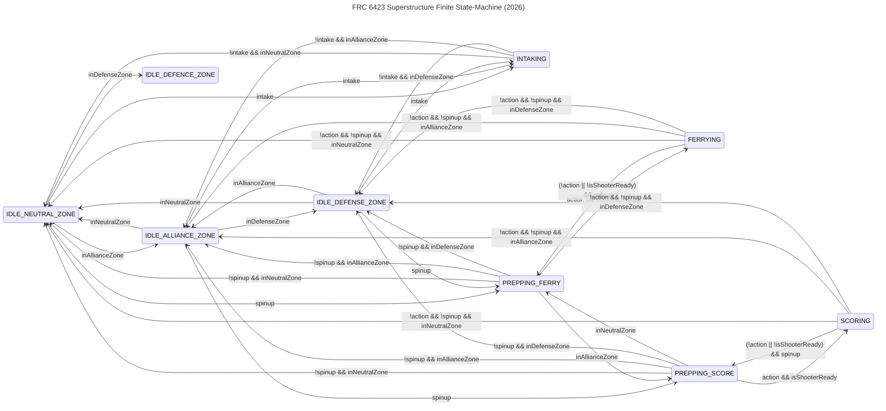

# Superstructure

```mermaid
---
title: FRC 6423 Superstructure Finite State-Machine (2026)
---
stateDiagram-v2
    direction LR
    IDLE_NEUTRAL_ZONE
    IDLE_ALLIANCE_ZONE
    IDLE_DEFENSE_ZONE
    INTAKING
    PREPPING_FERRY
    FERRYING
    PREPPING_SCORE
    SCORING

    IDLE_NEUTRAL_ZONE --> IDLE_ALLIANCE_ZONE: inAllianceZone
    IDLE_NEUTRAL_ZONE --> IDLE_DEFENCE_ZONE: inDefenseZone
    IDLE_NEUTRAL_ZONE --> INTAKING: intake
    IDLE_NEUTRAL_ZONE --> PREPPING_FERRY: spinup

    IDLE_ALLIANCE_ZONE --> IDLE_NEUTRAL_ZONE: inNeutralZone
    IDLE_ALLIANCE_ZONE --> IDLE_DEFENSE_ZONE: inDefenseZone
    IDLE_ALLIANCE_ZONE --> INTAKING: intake
    IDLE_ALLIANCE_ZONE --> PREPPING_SCORE: spinup

    IDLE_DEFENSE_ZONE --> IDLE_NEUTRAL_ZONE: inNeutralZone
    IDLE_DEFENSE_ZONE --> IDLE_ALLIANCE_ZONE: inAllianceZone
    IDLE_DEFENSE_ZONE --> INTAKING: intake
    IDLE_DEFENSE_ZONE --> PREPPING_FERRY: spinup

    INTAKING --> IDLE_NEUTRAL_ZONE: !intake && inNeutralZone
    INTAKING --> IDLE_ALLIANCE_ZONE: !intake && inAllianceZone
    INTAKING --> IDLE_DEFENSE_ZONE: !intake && inDefenseZone

    PREPPING_FERRY --> IDLE_NEUTRAL_ZONE: !spinup && inNeutralZone
    PREPPING_FERRY --> IDLE_ALLIANCE_ZONE: !spinup && inAllianceZone
    PREPPING_FERRY --> IDLE_DEFENSE_ZONE: !spinup && inDefenseZone
    PREPPING_FERRY --> PREPPING_SCORE: inAllianceZone
    PREPPING_FERRY --> FERRYING: action && isShooterReady

    FERRYING --> PREPPING_FERRY: (!action || !isShooterReady) && spinup
    FERRYING --> IDLE_NEUTRAL_ZONE: !action && !spinup && inNeutralZone
    FERRYING --> IDLE_ALLIANCE_ZONE: !action && !spinup && inAllianceZone
    FERRYING --> IDLE_DEFENSE_ZONE: !action && !spinup && inDefenseZone

    PREPPING_SCORE --> IDLE_NEUTRAL_ZONE: !spinup && inNeutralZone
    PREPPING_SCORE --> IDLE_ALLIANCE_ZONE: !spinup && inAllianceZone
    PREPPING_SCORE --> IDLE_DEFENSE_ZONE: !spinup && inDefenseZone
    PREPPING_SCORE --> PREPPING_FERRY: inNeutralZone
    PREPPING_SCORE --> SCORING: action && isShooterReady

    SCORING --> PREPPING_SCORE: (!action || !isShooterReady) && spinup
    SCORING --> IDLE_NEUTRAL_ZONE: !action && !spinup && inNeutralZone
    SCORING --> IDLE_ALLIANCE_ZONE: !action && !spinup && inAllianceZone
    SCORING --> IDLE_DEFENSE_ZONE: !action && !spinup && inDefenseZone
```
