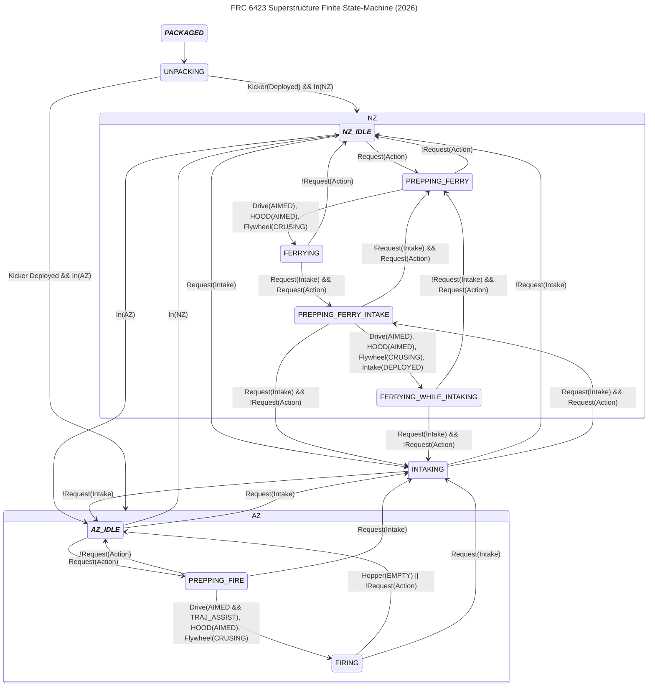

# Superstructure

## Requests
* Intake ~ Just what it sounds like
* Action
    * When in NZ, this is always just ferrying
    * When in AZ, this is always just shooting

## States
#### PACKAGED
Represents a state where kicker is folded within drivetrain

#### UNPACKING
Represents a state where intake is punching kicker to deploy it

#### INTAKING
Represents a state where intake is attempting to deploy and intake

#### NZ_IDLE
Represents a state where robot is idle in the neutral zone

## Subsystems + Their states
* In (representation of robotstate idk)
    * NZ ~ Neutral Zone
    * AZ ~ Alliance Zone
* Drive
    * AIMED ~ Heading is faced towards virtual target
    * TRAJ_ASSIST ~ Drive trajectory is rubberbanded for consistant shots
* Hood
    * AIMED ~ Pitch is at desired angle
* Flywheel
    * CRUSING ~ At desired velocity
* Hopper
    * UNKNOWN ~ After the hopper starts intaking again, there's no way to know if it has balls
    * EMPTY ~ If shooter beambreak stops detecting, it's assumed that there are no more balls
#### PREPPING_FERRY
Represents a state where robot preparing/aiming to ferry

#### FERRYING
Represents a state where robot is feeding balls to alliance zone

#### PREPPING_FERRY_INTAKE
Represents a state where robot is preparing/aiming to ferry while intaking

#### FERRYING_WHILE_INTAKING
Represents a state where robot is feeding balls to alliance zone while intaking

#### ***AZ_IDLE***
Represents a state where robot is idle in the neutral zone

#### PREPPING_FIRE
Represents a state where robot is preparing/aiming to shoot

#### FIRING
Represents a state where robot is shooting
